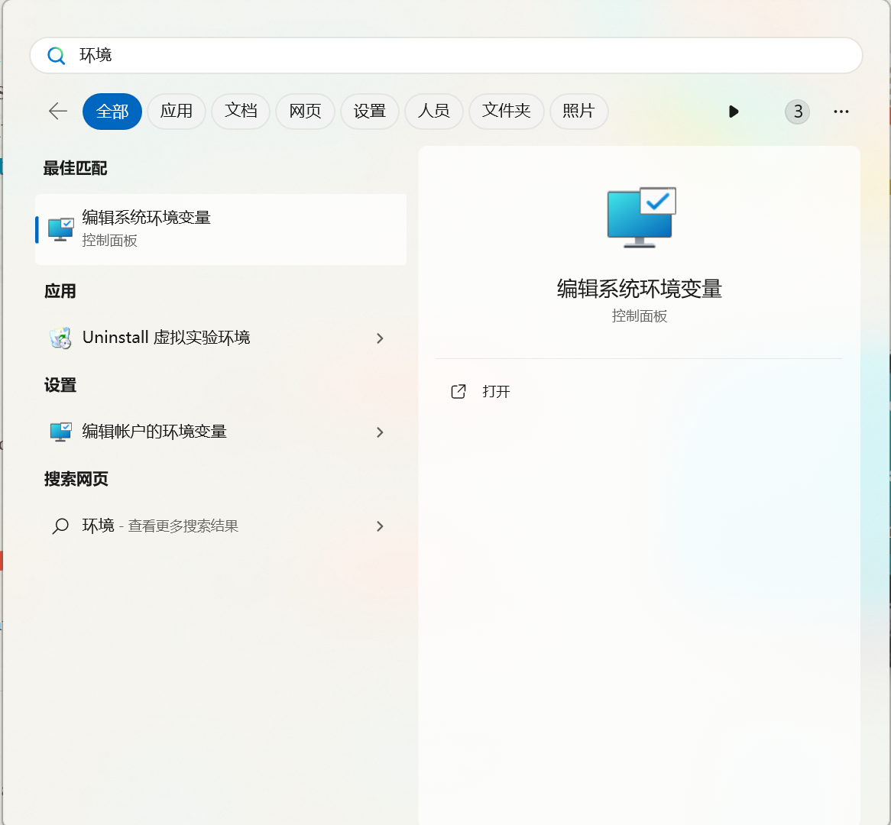

# git教程

今天我们来学一下从有到无，如何再 github 上创建项目，以及实现多人合作。由于CSDN上的教程没有类似的教程，我们这里就给大家写一下教程


## 第一步，确定git环境


要想使用github，git环境首先是要先确定好的

在官网上下载git包 [Git (git-scm.com)](https://git-scm.com/)，然后直接安装。

一定要记得自己下载到那里了。这里推荐下载到D盘的git文件夹中，没有的话可以创建此文件夹。

git比较好的一点是，他会自动帮你配环境，还是很方便的。但是还是不放心一些新学计算机的同学会出现问题，这里我们演示一下如何配置环境。（下载完之后直接查看[正确的显示](#2.正确的显示)，看自己是否自动配置）

### 1.编辑系统变量



如果再搜索栏里面找不到的话，右键点击“**开始**”


然后点开“**系统**”


然后点击“**高级系统设置**”


然后点击**“环境变量**”


在path中添加git路径。具体做法，选中path，然后点击**编辑**，之后在编辑中点击**新建**（注意顺序，一定要先点击**编辑**，再点击**新建**）

这里如果你下载到了D盘的git文件夹，你在path中添加的途径是D:\git\Git\cmd

直接添加上去就行。

### 2.正确的显示

然后在windows cmd命令行中输入

```
git --version
```

来确定你是否安装完毕


出现任意版本号便是正确的

## 注册github账号

github可能国内登录比较慢，但是还行（bushi

自己就慢慢摸索和注册吧，很简单的一个操作。

### 密钥私钥的创建

但是到着重看一下密钥私钥的创建

这里给大家推荐一个[blog](https://blog.csdn.net/weixin_42310154/article/details/118340458)，这个链接是git配置的教程，内容已经非常的详细了。这里会之后经行原创补充（其实就是照着blog抄（bushi） ）。

### github连接本地仓库

##### 概念

先介绍一下github中仓库的概念


一个用户可以有多个仓库，而每一个仓库最好只存放一个项目。仓库其实就是对应的是你放文件的总文件夹，它是放在云端，方便大家进行多人协作的。

##### 过程

###### 创建仓库


首先你可以看到**Top Repositories**的字样。然后你点击**new一个仓库**


记得点击取消readme.md文件，这对新手入手是一个非常友好的选择。


之后随便找一个文件夹（可以是你电脑存放代码的位置，班级文案的位置，是的你甚至可以选择把它当作你的移动硬盘，但是github限制了每一个免费用户的存储空间是1G,大概）

###### 仓库与云端的连接

new完仓库之后，就要经行仓库与云端 **的连接**


之后你可以在官方文档上看到一些字样，但是可能会有一些linux的命令符号，这里我们直接跳过她的教程，直接看我的就行

在cmd中移动到自己想要的文件夹中

```git
git init
git status
git commit -m "first comment"
git branch -M main
git remote add origin https://github.com/roboatLee/lee.git
git push -u origin main
```

大家注意看第五条命令

你们的网址他们会自己给出，具体的便是你蓝色的部分，直接复制粘贴就行。

连接成果！！！！

## git语法介绍
